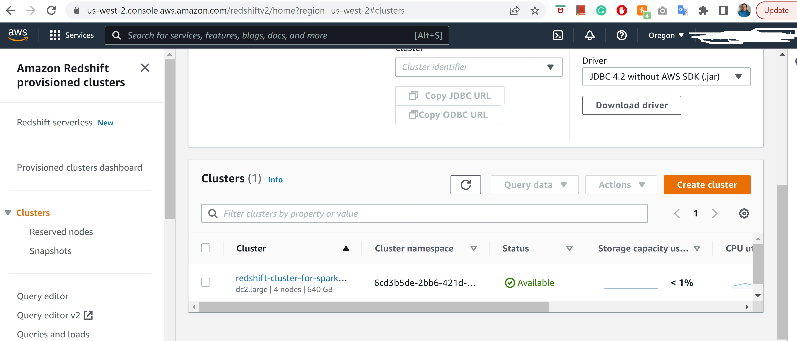
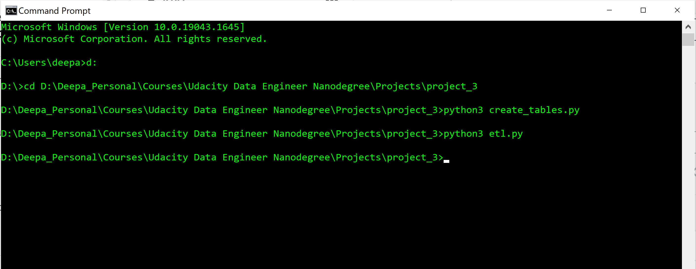

# Project: Build a Cloud Data Warehouse

 A music streaming startup, Sparkify, has grown their user base and song database and want to move their processes and data onto the cloud. Their data resides in S3, in a directory of JSON logs on user activity on the app, as well as a directory with JSON metadata on the songs in their app.
 This project focuses on building ELT pipeline for a database hosted on Amazon Redshift. Following are the steps followed:

1. Extracts song and user activity data from Amazon S3
2. Loads / copies these data into staging tables within Amazon Redshift
3. Transforms data into a set of dimensional tables

When data is available in these dimentional tables, Sparkify's analytics team will be able to continue finding insights into what songs their users are listening to.

## Project Structure
```
|____create_tables.py    # table creation script 
|____etl.py              # ELT builder
|____sql_queries.py      # SQL query collections
|____dwh.cfg             # AWS configuration file
|____test.ipynb          # testing
```

## ELT Pipeline
### sql_queries.py
- Includes SQL statements for dropping existing tables, creating staging and dimensional tables, copying data from S3 to staging tables, inserting data from staging tables to dimensional tables
- Below are the helper SQL query statements for `etl.py` and `create_tables.py`
    
    1. `*_table_drop`
    2. `*_table_create`
    3. `staging_*_copy`
    4. `*_table_insert`

### create_tables.py
- Includes code for dropping if exists and creating staging and dimensional table schemas
    
    1. `drop_tables` : Drops each of the tables in `drop_table_queries` list
    2. `create_tables`: Creates each of the tables in `create_table_queries` list

### etl.py
- ELT Pipeline builder
    
    1. `load_staging_tables`: Copies raw data to Redshift staging tables from AWS S3 bucket
    2. `insert_tables`: Transforms and inserts records to dimensional tables from staging tables

## Database Schema
### **Staging tables**:  `COPY` command is used to load dataset from S3 bucket to Amazon Redshift staging tables.
1. `staging_events`: Contains data from `Log Dataset`. This dataset resides on AWS S3 bucket at `s3://udacity-dend/log_data` location.

```
staging_events
        artist VARCHAR,
        auth VARCHAR,
        firstName VARCHAR,
        gender CHAR(1),
        iteminSession INT,
        lastName VARCHAR,
        length FLOAT,
        level VARCHAR,
        location TEXT,
        method VARCHAR,
        page VARCHAR,
        registration VARCHAR,
        sessionId INT,
        song VARCHAR,
        status INT,
        ts BIGINT,
        userAgent TEXT,
        userId INT
```
2. `staging_songs`: Contains data from `Song Dataset`. This dataset resides on AWS S3 bucket at `s3://udacity-dend/song_data` location.
```
staging_songs:
        num_songs INT,
        artist_id VARCHAR,
        artist_latitude FLOAT,
        artist_longitude FLOAT,
        artist_location TEXT,
        artist_name VARCHAR,
        song_id VARCHAR,
        title VARCHAR,
        duration FLOAT,
        year INT
```

### **Dimensional tables**
1. `songplay`: Contains records in event data associated with song plays i.e. records with `page=NextSong`. 
    - **Distribution style:** Since this table is really small, we used `diststyle all` as the distribution style. This helps in speeding up while performing joins. 
    - **Sorting Key:** Also a `sortkey` is applied on `start_time` column, so that the rows are sorted before distribution to slices. This minimizes the query time since each node has contiguous ranges of rows based on the `start_time` column.
    ```
    songplay:
            songplay_id INT IDENTITY(0,1),
            start_time TIMESTAMP NOT NULL sortkey,
            user_id INT NOT NULL,
            level VARCHAR,
            song_id VARCHAR NOT NULL,
            artist_id VARCHAR NOT NULL,
            session_id INT,
            location TEXT,
            user_agent TEXT,
            PRIMARY KEY(songplay_id)
    ```
2. `user`: Contains records in events data with `page=NextSong` and `userId IS NOT NULL`.
    - **Distribution style:** Since this table is really small, we used `diststyle all` as the distribution style. This helps in speeding up while performing joins. 
    - **Sorting Key:** Also a `sortkey` is applied on `user_id` column, so that the rows are sorted before distribution to slices. This minimizes the query time since each node has contiguous ranges of rows based on the `user_id` column.
```
user:
        user_id INT sortkey,
        first_name VARCHAR,
        last_name VARCHAR,
        gender CHAR(1),
        level VARCHAR,
        PRIMARY KEY(user_id)
```
3. `song`: Contains records from song data with `song_id IS NOT NULL`
     - **Sorting Key:** A `sortkey` is applied on `song_id` column, so that the rows are sorted before distribution to slices. This minimizes the query time since each node has contiguous ranges of rows based on the `song_id` column.
```
song:
        song_id VARCHAR sortkey,
        title VARCHAR NOT NULL,
        artist_id VARCHAR NOT NULL,
        year INT,
        duration FLOAT NOT NULL,
        PRIMARY KEY(song_id)
```

4. `artist`: Contains records from song data with `artist_id IS NOT NULL`
    - **Sorting Key:** A `sortkey` is applied on `artist_id` column, so that the rows are sorted before distribution to slices. This minimizes the query time since each node has contiguous ranges of rows based on the `artist_id` column.
```
artist:
        artist_id VARCHAR sortkey,
        name VARCHAR,
        location TEXT,
        lattitude FLOAT,
        longitude FLOAT,
        PRIMARY KEY(artist_id)
```

5. `time`: Contains timestamps of records in `songplays` broken down into specific units
    - **Distribution style:** Since this table is really small, we used `diststyle all` as the distribution style. This helps in speeding up while performing joins. 
    - **Sorting Key:** Also a `sortkey` is applied on `start_time` column, so that the rows are sorted before distribution to slices. This minimizes the query time since each node has contiguous ranges of rows based on the `start_time` column.
```
time:
        start_time TIMESTAMP sortkey,
        hour INT,
        day INT,
        week INT,
        month INT,
        year INT,
        weekday VARCHAR,
        PRIMARY KEY(start_time) 
```

## Project Setup
- **Step 1: Create Amazon Redshift Cluster:**
    - Create an Amazon Redshift cluster with  the following configurations:
        - Node Type: dc2.large
        - Number of nodes - 4
        - Security group: Attach a security group to authorize access to this Redshift cluster. A security group will act as firewall rules for this Redshift cluster to control inbound and outbound traffic.
        - IAM Role: Associate an IAM Role. This IAM role should have the `AmazonS3ReadOnlyAccess` permission attached to it. 
        - Database Configurations: Do the following configurations:
            - Database Name: Choose a db name
            - database port: `5439`
            - Admin User name and password: Choose an Admin user name and Admin user password

    - Make sure the cluster is created successfully. Also note the Endpoint.
    
- **Step 2: Fill in Amazon Redshift cluster details in `dwh.cfg` file:** 
    - Provide the Amazon Redshift database details and IAM role details on the `dwh.cfg` - AWS configuration file. Below is an example:

        ```
        [CLUSTER]
        HOST=<my redshift endpoint>
        DB_NAME=sparkifydb
        DB_USER=awsuser
        DB_PASSWORD=awsuser123
        DB_PORT=5439
        [IAM_ROLE]
        ARN='<arn of iam role>'
        ```
- **Step 3: Create all the required tables:**
    - Open command prompt and navigate to the location where `create_tables.py` file is located
    - Run the `create_tables.py` in command prompt using `python3 create_tables.py` command
    - Open Query Editor in Amazon Redshift UI to make sure that all the tables are created as expected. Attached

- **Step 4: Load Staging tables, Fact and Dimensional tables:** 
    - Open command prompt and navigate to the location where `etl.py` is located
    - Run this file in command prompt using `python3 etl.py` command
    - Open Query Editor in Amazon Redshift UI to make sure that all the tables are loaded as expected.

        
- **Optional: test.ipynb:** This file illustrates the testing of `create_tables.py` and `etl.py` files. Also included the SELECT statements to showcase the data within staging, fact and dimensional tables.

## References
- [Postgres Epoch to Timestamp](https://mindmajix.com/community/1749/postgres-epoch-to-timestamp)

- [COPY commad: Load data from Amazon S3 to Amazon Redshift](https://docs.aws.amazon.com/redshift/latest/gsg/rs-gsg-create-sample-db.html)

## Thank You


