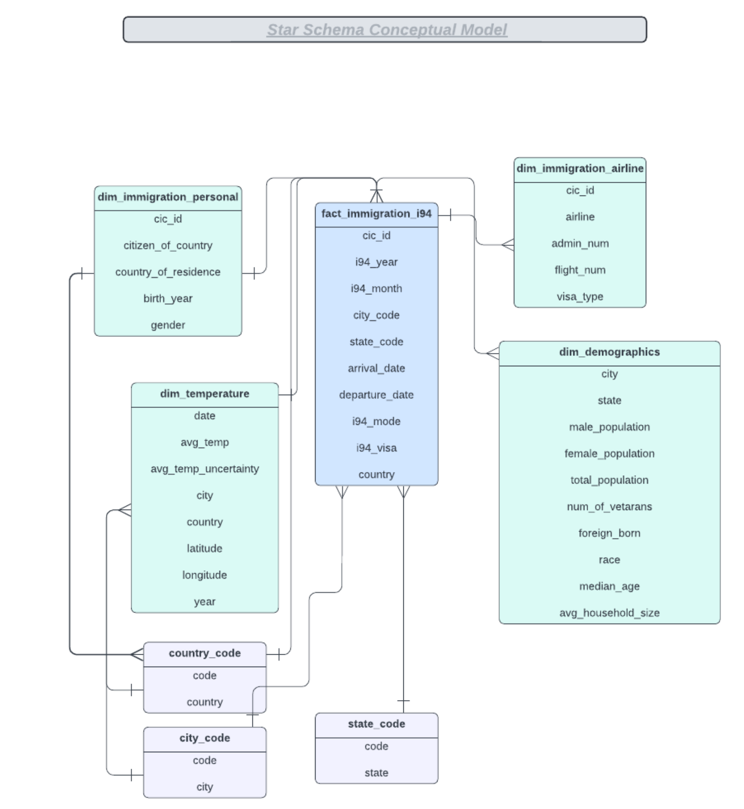

# Capstone Project: Analysis of United States Immigration Data and Creating Spark-warehouse
## Project Summary
The goal of the project is to create a spark-warehouse with fact and dimension tables in star schema. This objective is achieved by integrating data from different data sources for the purpose of data analysis and future backened querying. Additionally, the U.S Customs & Border Protection Department could leverage this source-of-truth database to open the solution through a web API so backend web services could query the warehouse for information relating to international visitors.

## Project Description
The project follows the following steps:

- Step 1: Describes the scope of the Project and gathers data
- Step 2: Explore and Assess the Data
- Step 3: Defines the Data Model
- Step 4: Runs ETL to Model the Data
- Step 5: Completes Project Write Up

Please refer to 
[CapestoneProject_USAImmigrationDataAnalysis](./CapestoneProject_USAImmigrationDataAnalysis.ipynb) for detailed descriptions

## Dataset
- **I94 Immigration Data Set:** U.S. immigration officers issued the I-94 Form (Arrival/Departure Record) to foreign visitors (e.g., business visitors, tourists and foreign students) who lawfully entered the United States. The I-94 is a white paper form that a foreign visitor received from cabin crews on arrival flights and from U.S. Customs and Border Protection at the time of entry into the United States. It listed the traveler's immigration category, port of entry, data of entry into the United States, status expiration date and had a unique 11-digit identifying number assigned to it. Its purpose is to record the traveler's lawful admission to the United States. This is the main dataset and there is a file for each month of the year of 2016 available in the directory ../../data/18-83510-I94-Data-2016/ in the SAS binary database storage format sas7bdat. When combined, the 12 datasets have than 40 million rows (40,790,529) and 28 columns. For most of the work, only the month of April of 2016 data is used which has more than three million records (3,096,313).

- **World Temperature Data:** The dataset provides a long period of the world's montly average temperature (from year 1743 to 2013) at different country in the world wide. The Berkeley Earth, which is affiliated with Lawrence Berkeley National Laboratory, has repackaged the data from a newer compilation. The Berkeley Earth Surface Temperature Study combines 1.6 billion temperature reports from 16 pre-existing archives. It is nicely packaged and allows for slicing into interesting subsets (for example by country). They publish the source data and the code for the transformations they applied. They also use methods that allow weather observations from shorter time series to be included, meaning fewer observations need to be thrown away. In the original dataset from Kaggle, several files are available but in this capstone project we will be using only the GlobalLandTemperaturesByCity.csv

- **U.S. City Demographic Data:** This data comes from the US Census Bureau's 2015 American Community Survey. This dataset contains information about the demographics of all US cities and census-designated places with a population greater or equal to 65,000. We will be using us-cities-demographics.csv file.

The descriptions contained in I94_SAS_Labels_Descriptions.SAS file will also be utilized.

## Conceptual Data Model: Star Schema
The Star Schema (Fact and Dimension Schema) is used for data modeling in this ETL pipeline. This model enables to search the database schema with the minimum number of *SQL JOIN*s possible and enable fast read queries. 

## References
- [I94 Immigration Data](https://www.trade.gov/national-travel-and-tourism-office)
- [ World Temperature Data](https://www.kaggle.com/datasets/berkeleyearth/climate-change-earth-surface-temperature-data)
- [U.S. City Demographic Data](https://public.opendatasoft.com/explore/dataset/us-cities-demographics/export/)
- [PySpark Module](https://spark.apache.org/docs/2.4.0/api/python/pyspark.sql.html)
- [Directory of Visa Categories](https://travel.state.gov/content/travel/en/us-visas/visa-information-resources/all-visa-categories.html)
- [pyspark.sql.functions.lit](https://spark.apache.org/docs/3.1.1/api/python/reference/api/pyspark.sql.functions.lit.html)
## Thank You