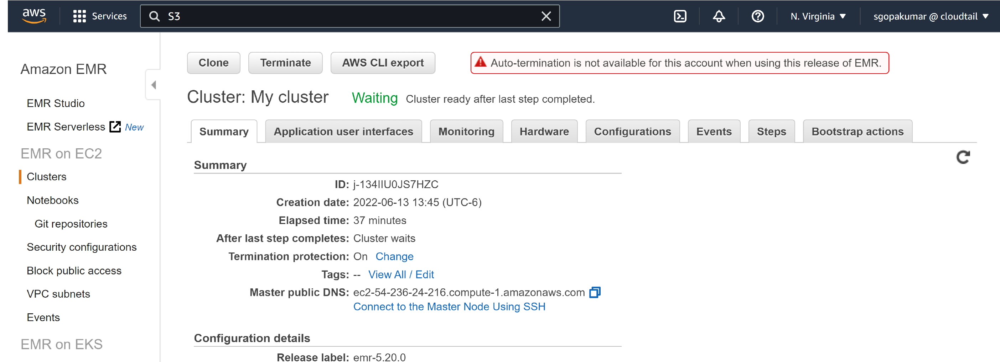
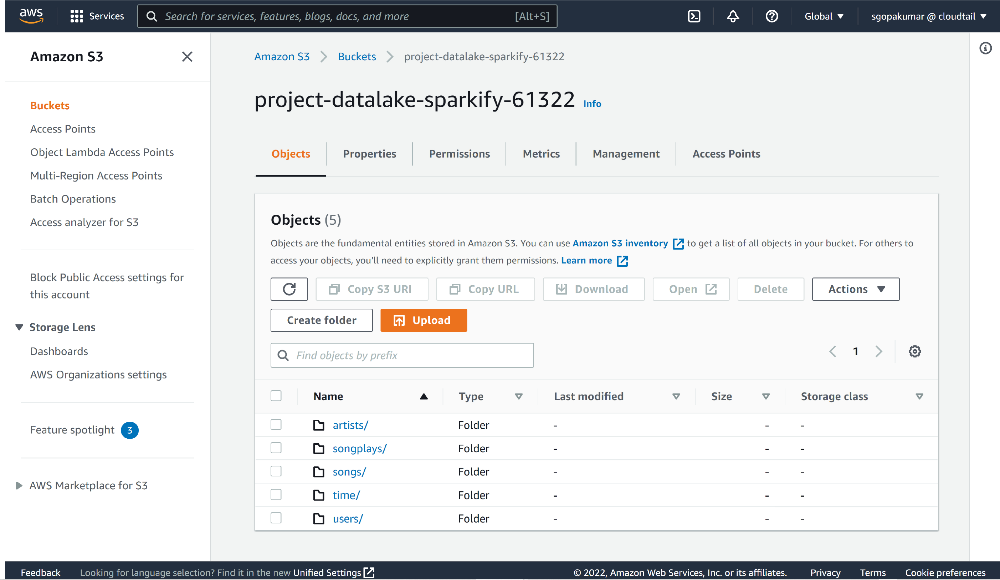

# Project: Data Lake
A startup called Sparkify wants to analyze the data they've been collecting on songs and user activity on their new music streaming application. Sparkify has grown their user base and song database large and want to move their data warehouse to a data lake. Their data resides in S3, in a directory of JSON logs on user activity on the application, as well as a directory with JSON metadata on the songs in their app.

They'd like a data engineer to build an ETL pipeline that extracts their data from S3, processes them using Spark, and loads the data back into S3 as a set of fact and dimensional tables. This will allow their analytics team to continue finding insights in what songs their users are listening to. The role of this project is to create a data lake on cloud (AWS S3) and build ETL pipeline for this process.

## Project Description
In this project, we will build a data lake on AWS S3 and build an ETL pipeline for a data lake hosted on S3. The data is loaded from S3 and processed into analytics tables using Spark and the processed data is loaded back into S3 in the form of parquet files.

## Dataset
### Song Dataset

Songs dataset is a subset of [Million Song Dataset](http://millionsongdataset.com/). Each file in the dataset is in JSON format and contains meta-data about a song and the artist of that song. The dataset is hosted at AWS S3 bucket `s3://udacity-dend/song_data` by Udacity.

Sample Record :

```
{"num_songs": 1, "artist_id": "ARJIE2Y1187B994AB7", "artist_latitude": null, "artist_longitude": null, "artist_location": "", "artist_name": "Line Renaud", "song_id": "SOUPIRU12A6D4FA1E1", "title": "Der Kleine Dompfaff", "duration": 152.92036, "year": 0}
```

### Log Dataset

Logs dataset is generated by [Event Simulator](https://github.com/Interana/eventsim). These log files in JSON format simulate activity logs from a music streaming application based on specified configurations. The dataset is hosted at AWS S3 bucket `s3://udacity-dend/log_data` by Udacity.

Sample Record :

```
{"artist": null, "auth": "Logged In", "firstName": "Walter", "gender": "M", "itemInSession": 0, "lastName": "Frye", "length": null, "level": "free", "location": "San Francisco-Oakland-Hayward, CA", "method": "GET","page": "Home", "registration": 1540919166796.0, "sessionId": 38, "song": null, "status": 200, "ts": 1541105830796, "userAgent": "\"Mozilla\/5.0 (Macintosh; Intel Mac OS X 10_9_4) AppleWebKit\/537.36 (KHTML, like Gecko) Chrome\/36.0.1985.143 Safari\/537.36\"", "userId": "39"}
```


## Project Structure
```
|____etl.py     # Loads and processes the data from S3 and stores them back to S3
|____dl.cfg     # AWS configuration file
|___ReadME.md   # Readme documentation to understand about the project and project set up
```

## Project Setup
- **Step 1: Create AWS EMR Cluster:**
    - Launch an AWS EMR cluster with the below configuration:
        - Release: emr-5.20.0 or later
        - Applications: Spark: Spark 2.4.0 on Hadoop 2.8.5 YARN with Ganglia 3.7.2 and Zeppelin 0.8.0
        - Instance type: m3.xlarge
        - Number of instance: 3
        - EC2 key pair: Create an EC2 key pair and choose that one here
    
        Below is the screenshot of a successfully launched EMR cluster

        

- **Step 2: Connect to Master Node**
    - On the main page for EMR cluster in the AWS console, click on "Connect to Master Node Using SSH" next to "Master public DNS"
    - On the terminal copy the command to ssh into the master node. It should look roughly as follows:
        ```
        ssh -i PATH_TO_MY_KEY_PAIR_FILE.pem hadoop@ec2-99-99-999-999.us-east-1.compute.amazonaws.com
        ```
    - Using sudo, append the following line to the /etc/spark/conf/spark-env.sh file:
        ```
        export PYSPARK_PYTHON=/usr/bin/python3
        ```

- **Step 3: Create a local tunnel to the EMR Spark History Server**
    - To establishes a tunnel between your local port 8157 and port 18080 on the master node, open the terminal and using the proper IP of the master node run the following command:
        ```
        ssh -i PATH_TO_MY_KEY_PAIR_FILE.pem -N -D 8157 hadoop@ec2-99-99-999-999.us-east-1.compute.amazonaws.com
        ```
    - To see the Spark History Server UI, use the below link (obtained from Application User Interfaces tab of the EMR cluster for Spark UI) on the web browser:
        ```
        http://ec2-99-999-99-999.compute-1.amazonaws.com:18080/
        ```
- **Step 4: Run the Job**
    - Give correct configuration details in dl.cfg. Fill in the AWS_ACCESS_KEY_ID, AWS_SECRET_ACCESS_KEY. Use SOURCE_S3_BUCKET=s3a://udacity-dend/. Create a AWS S3 bucket to store the processed file in parquet format. See the example below:
        ```
        [AWS]
        AWS_ACCESS_KEY_ID=12389900fh4567hgdgfgfd
        AWS_SECRET_ACCESS_KEY=jhgjhg546546njhgjkjhkj3234567

        [S3]
        SOURCE_S3_BUCKET=s3a://udacity-dend/
        DEST_S3_BUCKET=s3a://project-datalake-sparkify/
        ```
    - Copy dl.cfg and etl.py to the hadoop account directory on EMR using the below command:
        ```
        scp -i PATH_TO_MY_KEY_PAIR_FILE.pem <location of dl.cfg file or etl.py file> spark-emr:/home/hadoop/
        ```
    - Use the below command to run the python file - etl.py.
        ```
        /usr/bin/spark-submit --master yarn ./etl.py
        ```
    - After a couple of minutes your job should show up in the Spark History Server page in your browser

- **Step 5: Explore processed files in AWS S3:**
    - The processed files can be explored at the AWS S3 bucket.
    - Songs table files are partitioned by year and then artist. 
    - Time table files are partitioned by year and month. 
    - Songplays table files are partitioned by year and month.
    
    Below is a screen shot of the processed files:
      

## ETL Pipeline
### etl.py
ETL pipeline builder

1. `process_song_data`
	* Loads the song_data from AWS S3 (input_data) and extracts the _songs_ and _artists_ tables
    and then load the processed data back to S3 (output_data)

2. `process_log_data`
	* Loads the log_data from AWS S3 (input_data) and extracts the _users_, _time_, _songplays_ tables
    and then load the processed data back to S3 (output_data)

## Database Schema
The Star Database Schema (Fact and Dimension Schema) is used for data modeling in this ETL pipeline. There is one fact table containing all the metrics (facts) associated to each event (user actions), and four dimensions tables, containing associated information such as user name, artist name, song meta-data etc. This model enables to search the database schema with the minimum number of *SQL JOIN*s possible and enable fast read queries. 

The data stored on S3 buckets is extracted and processed using Spark, and is then inserted into the fact and dimensional tables. These tables are stored back to S3 in parquet files, organized for optimal performance.

### Fact table

#### songplays table

|  songplays  |    type   |
|-------------|-----------|
| songplay_id | INT       |
| start_time  | TIMESTAMP |
| user_id     | INT       |
| level       | VARCHAR   |
| song_id     | VARCHAR   |
| artist_id   | VARCHAR   |
| session_id  | INT       |
| location    | TEXT      |
| user_agent  | TEXT      |


### Dimension tables

#### users table

|    users   |   type  |
|------------|---------|
| user_id    | INT     |
| first_name | VARCHAR |
| last_name  | VARCHAR |
| gender     | CHAR(1) |
| level      | VARCHAR |

#### songs table

|   songs   |   type  |
|-----------|---------|
| song_id   | VARCHAR |
| title     | VARCHAR |
| artist_id | VARCHAR |
| year      | INT     |
| duration  | FLOAT   |

#### artists table

|   artists  |   type  |
|------------|---------|
| artist_id  | VARCHAR |
| name       | VARCHAR |
| location   | TEXT    |
| latitude   | FLOAT   |
| longitude   | FLOAT   |

#### time table

|    time    |    type   |
|------------|-----------|
| start_time | TIMESTAMP |
| hour       | INT       |
| day        | INT       |
| week       | INT       |
| month      | INT       |
| year       | INT       |
| weekday    | VARCHAR   |


## References
- [Writing Parquet Files in Python with PySpark](https://mungingdata.com/python/writing-parquet-pandas-pyspark-koalas/)
- [How do I configure Amazon EMR to run a PySpark job using Python 3.4 or 3.6?](https://aws.amazon.com/premiumsupport/knowledge-center/emr-pyspark-python-3x/)

## Thank You


