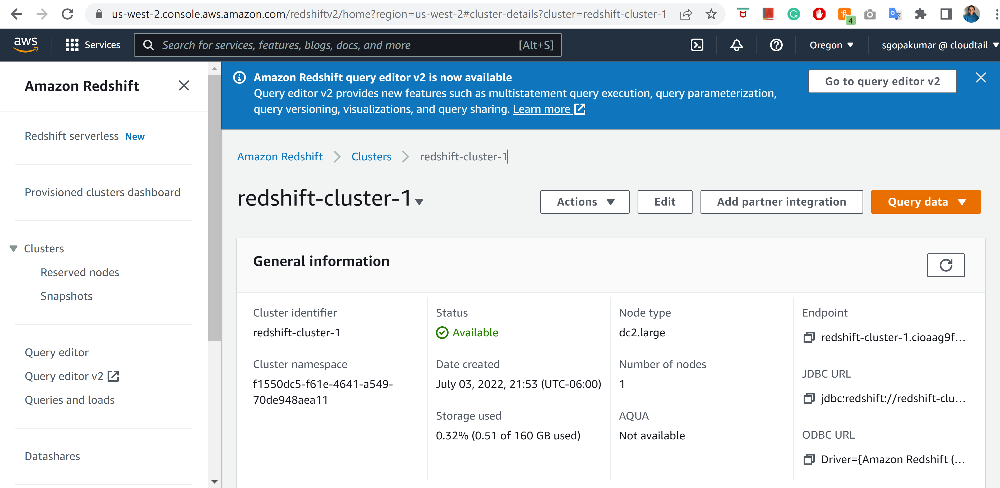
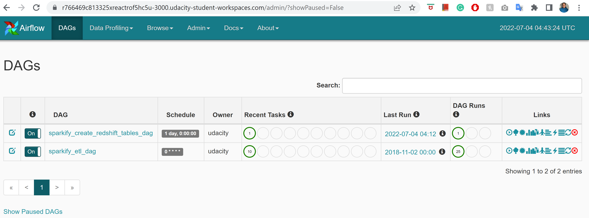
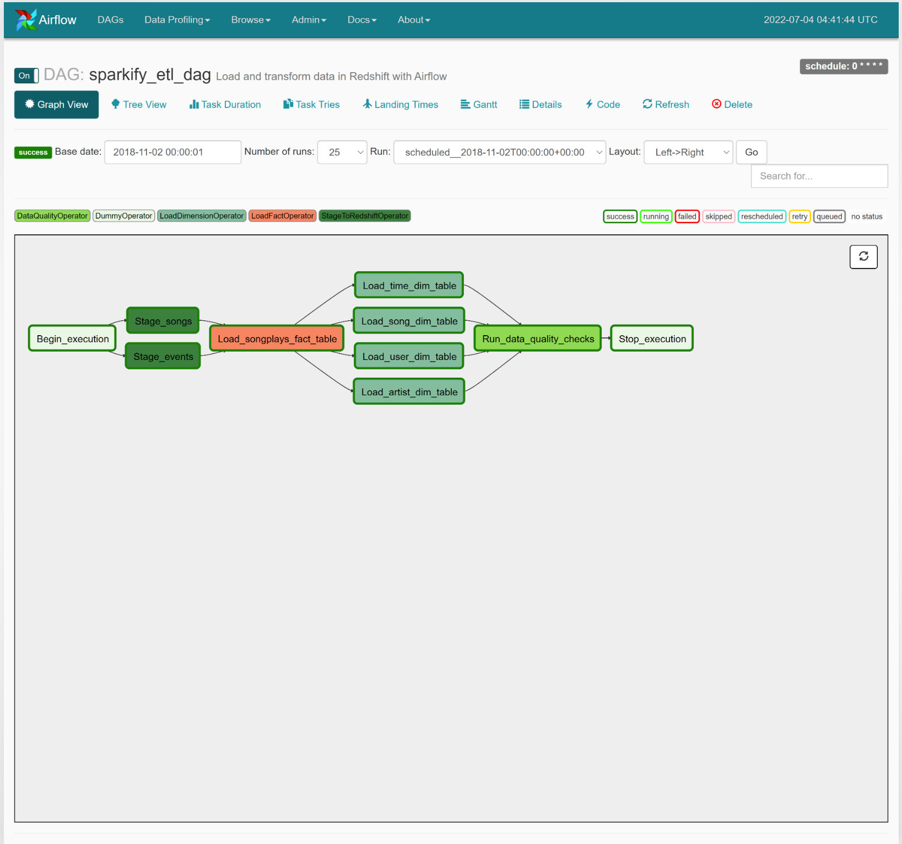

# Project: Data Pipelines
A music streaming company, Sparkify, has decided that it is time to introduce more automation and monitoring to their data warehouse ETL pipelines and come to the conclusion that the best tool to achieve this is Apache Airflow.

They'd like to create high grade data pipelines that are dynamic and built from reusable tasks, can be monitored, and allow easy backfills. They have also noted that the data quality plays a big part when analyses are executed on top of the data warehouse and want to run tests against their datasets after the ETL steps have been executed to catch any discrepancies in the datasets.

## Project Description
In this project, we will build a data pipeline on Apache Airflow. The source data resides in S3 and needs to be processed in Sparkify's data warehouse in Amazon Redshift. In Apache Airflow, we configure and schedule the following tasks:

- stage data from s3 to redshift staging tables
- load dimensional tables- *user_info*, *songs*, *artists*, *time*
- load fact table - *songplays*
- perform data quality check to track data lineage
## Dataset
### Song Dataset

Songs dataset is a subset of [Million Song Dataset](http://millionsongdataset.com/). Each file in the dataset is in JSON format and contains meta-data about a song and the artist of that song. The dataset is hosted at AWS S3 bucket `s3://udacity-dend/song_data` by Udacity.

Sample Record :

```
{"num_songs": 1, "artist_id": "ARJIE2Y1187B994AB7", "artist_latitude": null, "artist_longitude": null, "artist_location": "", "artist_name": "Line Renaud", "song_id": "SOUPIRU12A6D4FA1E1", "title": "Der Kleine Dompfaff", "duration": 152.92036, "year": 0}
```

### Log Dataset

Logs dataset is generated by [Event Simulator](https://github.com/Interana/eventsim). These log files in JSON format simulate activity logs from a music streaming application based on specified configurations. The dataset is hosted at AWS S3 bucket `s3://udacity-dend/log_data` by Udacity.

Sample Record :

```
{"artist": null, "auth": "Logged In", "firstName": "Walter", "gender": "M", "itemInSession": 0, "lastName": "Frye", "length": null, "level": "free", "location": "San Francisco-Oakland-Hayward, CA", "method": "GET","page": "Home", "registration": 1540919166796.0, "sessionId": 38, "song": null, "status": 200, "ts": 1541105830796, "userAgent": "\"Mozilla\/5.0 (Macintosh; Intel Mac OS X 10_9_4) AppleWebKit\/537.36 (KHTML, like Gecko) Chrome\/36.0.1985.143 Safari\/537.36\"", "userId": "39"}
```


## Project Structure
```
|____dags
| |____ create_redshift_tables_dag.py   # Airflow DAG for creating tables on AWS Redshift
| |____ create_tables.sql      # SQL CREATE queries
| |____ udac_example_dag.py    # Airflow DAG to perform ETL data pipeline
|____plugins
| |____ __init__.py            # Define plugins class
| |____helpers
| | |____ __init__.py
| | |____ sql_queries.py       # Supporting SQL queries for loading fact and dimension tables 
| |____operators
| | |____ __init__.py          
| | |____ stage_redshift.py    # Operator to COPY data from S3 to Redshift staging tables
| | |____ load_fact.py         # Operator to INSERT data into fact table
| | |____ load_dimension.py    # Operator to INSERT data into dimension tables
| | |____ data_quality.py      # Operator to perform data quality check after ETL process
```

## Project Setup
- **Step 1: Create an IAM User:**
    - Create an IAM User with the following configurations:
        - Check the field Access key - Programmatic access
        - In the Set permissions section, select Attach existing policies directly and choose the below policies:
            - AdministratorAccess
            - AmazonRedshiftFullAccess
            - AmazonS3FullAccess
        - Note the Access key id and Secret access key which will be later configured in Apache Airflow
- **Step 2: Create AWS Redshift Cluster:**
    - Launch an AWS Redshift cluster (on us-west-2 region since the dataset is located on this region) with the below configurations:
        - Cluster configuration: Free trial, this will have dc2.large node type and number of nodes: 1
        - Database configuration: Choose a user and password, which will be later used in Apache Airflow
    - Once the status becomes available:
        - enable it to be publicly accessible
        - enable enhanced VPC routing
        - in the VPC security group's inboud rule add an inbound rule with the following configuration:
            - Type = Custom TCP
            - Port range = 0 - 5500
            - Source = Anywhere-iPv4
    - Also note the endpoint which will be later used in Apache Airflow.
    Below is the screen shot of a Redshift cluster with Available status 

        
- **Step 3: Turn on Airflow and Add Connections Configurations:**
    - Launch Apache Airflow UI by running **/opt/airflow/start.sh**
    - Configure the below connections in the Admin -> Connections -> Create :
        - For connecting Airflow to AWS:
            - Conn Id: aws_credentials
            - Conn Type: Amazon Web Services
            - Login: Access key ID from the IAM User credentials created earlier
            - Password: Secret access key from the IAM User credentials created earlier
        - For running Airflow with Redshift:
            - Conn Id: redshift
            - Conn Type: Postgres
            - Host: Endpoint of Redshift cluster, excluding the port and schema name at the end
            - Schema: dev. This is the Redshift database we want to connect to.
            - Login: User name created when launching Redshift cluster
            - Password: Passsword created when launching Redshift cluster
            - Port: 5439
- **Step 4: Create Redshift tables:**
    - On the Airflow DAGs UI, turn on the **_sparkify_create_redshift_tables_dag_** to create the staging tables, fact and dimension tables in Amazon Redshift Cluster
- **Step 5: Load Fact and Dimension tables:**
    - On the Airflow DAGs UI, turn on the **_sparkify_etl_dag_** to:
        - load data from S3 to staging tables _staging_events_ and _staging_songs_. Leveraged the COPY command
        - load data into fact and dimension tables

    Below is the Apache Airflow UI
    

## Apache Airflow DAG Configuration
### **Configuring the DAG**
In the DAG, default parameters are set as follows:
- The DAG does not have dependencies on past runs
- DAG's schedule interval is hourly
- On failure, the task are retried 3 times
- Retries happen every 5 minutes
- Catchup is turned off
- No emails are sent on retry

From the below Graph View, the DAG's task dependency is evident:


### **Operators**
Operators are used to stage the data, transform the data, and run checks on data quality. Also utilized Airflow's built-in functionalities like connections and hooks. 
#### **Dummy Operators:**
- DAG begins with a start execution task and stop execution task.
- **DummyOperator** is used to define the Begin Execution and Stop Execution tasks
#### **Stage Operator:**
- The stage operator, **_StageToRedshiftOperator_** loads JSON formatted files from S3 to Amazon Redshift staging tables _staging_events_ and _staging_songs_. The operator creates and runs a SQL COPY statement based on the parameters provided.
-  It uses templated field that allows it to load timestamped files from S3 based on the execution time and run backfills.
- **_stage_events_to_redshift_** and **_stage_songs_to_redshift_** tasks use this **_StageToRedshiftOperator_**. This operator uses logging to give useful information about the different steps involved in execution.
- Database connection is created by using a hook and a connection. Connections can be accessed in code via hooks. Hooks provide a reusable interface to external systems and databases. 
#### **Fact And Dimension Operators:**
- **_LoadFactOperator_** and **_LoadDimensionOperator_** operators load data from staging tables to fact and dimension tables respectively.
- These operators use SQL helper class to run data transformations which is used as one of the inputs to this operator. Other inputs to these operators are the target database and target tables
- **_load_songplays_table_** task uses **_LoadFactOperator_** operator to load data to **_songplays_** fact table. Fact tables are usually so massive that they should only allow append type functionality.
 - **_load_user_dimension_table_**, **_load_song_dimension_table_**, **_load_artist_dimension_table_**, **_load_time_dimension_table_** tasks use **_LoadDimensionOperator_** operator to load data from staging tables to **_user_info_**, **_songs__**, **_artists_**, **_time_** dimension tables. Dimension table loads are done with the truncate-insert pattern where the target table is emptied before the load. Switched between the **mode="append-only"** and **mode="delete-load"**
#### **Data Quality Operator:**
- **_DataQualityOperator_** operator is used to run checks on the data. The operator's main functionality is to receive one or more SQL based test cases along with the expected results and execute the tests. For each of the tests, the test result and expected result is checked and if there is no match, the operator raises an exception and the task retries.
- Operator uses params to get the tests and the results, tests are not hard coded to the operator
- **_run_quality_checks_** task uses **_DataQualityOperator_** operator
- Data quality check is performed on **_songplays_**,  **_user_info_**, **_songs__**, **_artists_**, **_time_** tables to ensure there are no empty tables after the data loading process.

## Database Schema
The Star Database Schema (Fact and Dimension Schema) is used for data modeling in this ETL pipeline. There is one fact table containing all the metrics (facts) associated to each event (user actions), and four dimensions tables, containing associated information such as user name, artist name, song meta-data etc. This model enables to search the database schema with the minimum number of *SQL JOIN*s possible and enable fast read queries. 

The data stored on S3 buckets is loaded to fact and dimension tables within Amazon Redshift cluster. This data pipeline is executed with the help of Apache Airflow whose DAG is executed hourly once.

### Fact table

#### songplays table

|  songplays  |    type   |
|-------------|-----------|
| playid | VARCHAR       |
| start_time  | TIMESTAMP |
| userid     | INT       |
| level       | VARCHAR   |
| songid     | VARCHAR   |
| artistid   | VARCHAR   |
| sessionid  | INT       |
| location    | VARCHAR      |
| user_agent  | VARCHAR      |


### Dimension tables

#### user_info table

|    user_info   |   type  |
|------------|---------|
| userid    | INT     |
| first_name | VARCHAR |
| last_name  | VARCHAR |
| gender     | VARCHAR |
| level      | VARCHAR |

#### songs table

|   songs   |   type  |
|-----------|---------|
| songid   | VARCHAR |
| title     | VARCHAR |
| artistid | VARCHAR |
| year      | INT     |
| duration  | NUMERIC   |

#### artists table

|   artists  |   type  |
|------------|---------|
| artistid  | VARCHAR |
| name       | VARCHAR |
| location   | VARCHAR    |
| latitude   | NUMERIC   |
| longitude   | NUMERIC   |

#### time table

|    time    |    type   |
|------------|-----------|
| start_time | TIMESTAMP |
| hour       | INT       |
| day        | INT       |
| week       | INT       |
| month      | VARCHAR       |
| year       | INT       |
| weekday    | VARCHAR   |


## References
- [Airflow Scheduling and Triggers](https://airflow.apache.org/docs/apache-airflow/1.10.1/scheduler.html)
- [Airflow Default Arguments](https://airflow.apache.org/docs/apache-airflow/stable/tutorial.html#default-arguments)
- [Managing Dependencies in Apache Airflow](https://www.astronomer.io/guides/managing-dependencies/)
- [Declaring a DAG](https://airflow.apache.org/docs/apache-airflow/stable/concepts/dags.html)

## Thank You


